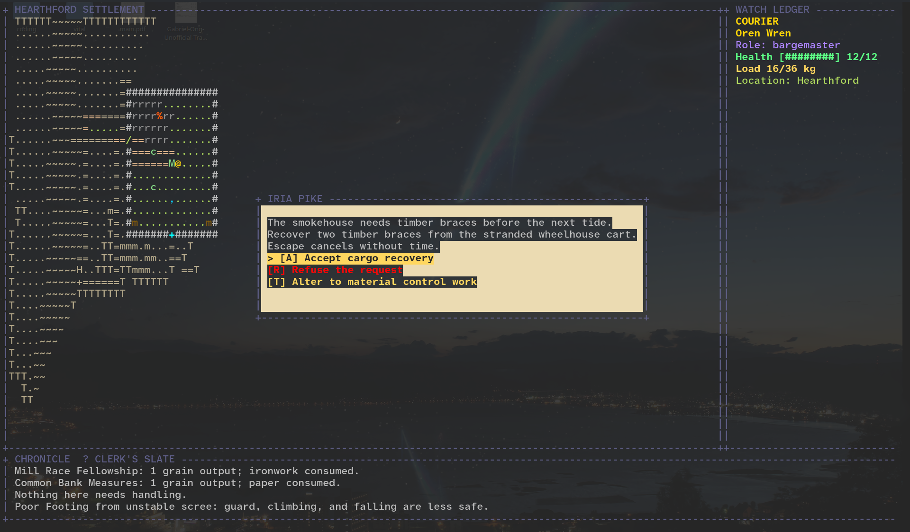
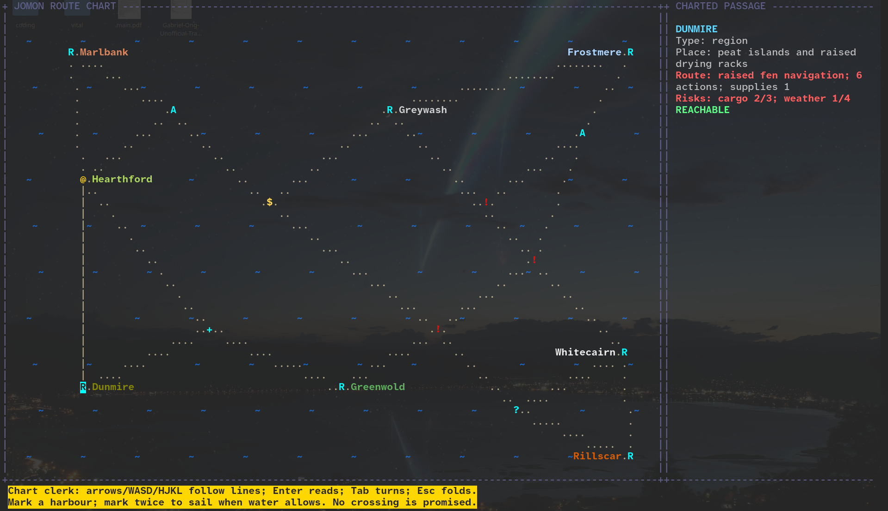
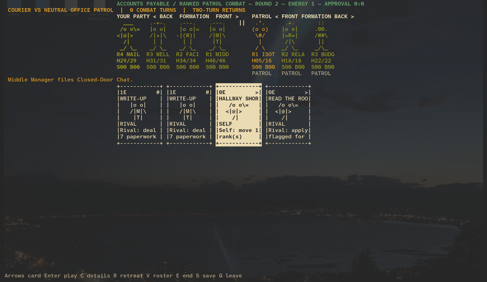
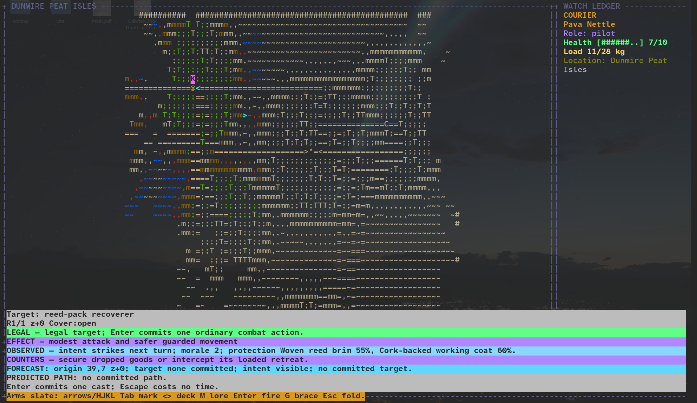
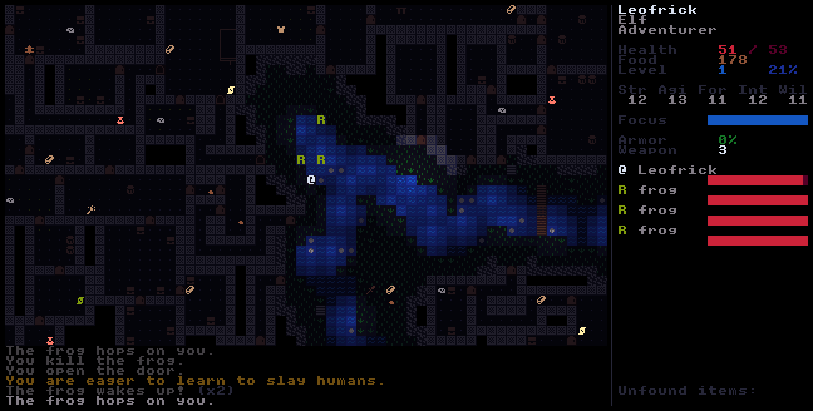

[](https://github.com/gongahkia/roag/releases/tag/1.0)

# `Roag` 🗡️

A [persistent](https://cavesofqud.com/) roguelike where you're a [late-medival mailman](https://en.wikipedia.org/wiki/Jōmon_people).

## Stack

* [Lua](https://www.lua.org/)
* [LÖVE2d](https://love2d.org/)

## Screenshots






## Usage

> [!NOTE]  
> `Roag` minimally requires a 80-column by 24-row terminal.

The below instructions are for locally running `Roag`.

1. First clone the repository.

```console
$ git clone https://github.com/gongahkia/roag && cd roag
```

2. Then run the below from repo root.

```console
$ love .
```

## Controls

| Key | Action |
| --- | --- |
| `W` / `A` / `S` / `D` | **Campaign:** cardinal movement only; the most recently pressed held direction wins. Movement sets facing. |
| `E` | **Campaign:** attack with the active quick weapon in the facing direction. Empty ranged magazines reload instead of firing. |
| `R` | **Campaign:** swap quick weapon; a successful field swap costs one turn |
| `Q` | **Campaign:** use the active quick ability (Dash is a default ability binding) |
| `B` | Arm a bomb |
| `F` | Light a flare; it stuns enemies in its blast |
| `X` | **Campaign:** swap quick ability; a successful field swap costs one turn |
| `I` | Open carried inventory; press `Tab` in Campaign to assign weapon/ability quick slots while the world is paused |
| Mouse drag in inventory | Repack cargo with a live valid/invalid placement preview |
| `C` | Open the campaign construction menu |
| `U` | **Campaign:** use exactly the faced tile: doors, storage, services, stations, connections, cargo, or corpse salvage |
| `Tab` / `W` / `S` / Enter / `R` / `F` in reconstruction | Switch body/inventory focus, select, install or uninstall, rotate cargo, and finish reconstruction |
| `W` / `S` or arrow keys | Select a class, boon, curse, or shop item in a menu |
| Enter or `E` | Confirm a menu choice or leave the shop for the boss |
| `B` / `V` in the shop | Buy / sell the selected item |
| Escape | Quit the game |

Campaign uses two identity-bound quick weapon slots and two quick ability slots; `E` and `Q` always use the active selections shown in the HUD. Ranged reserve ammunition is physical 1×1 cargo (bullets, shells, energy cells, or explosives), while a loaded magazine stays on its exact physical weapon component.

Legacy/run-based mode retains its compatibility controls: diagonal held WASD movement, arrow-key firing, `G` for nearby corpse salvage, the generic ammo wallet, and the installed-body ability list.

## Reference

Name-wise, `Roag` pays homage to [Rogue (1980)](https://en.wikipedia.org/wiki/Rogue_(video_game)). Duh. 

In its gameplay, `Roag` takes heavy inspiration from [Bob Nystrom](https://github.com/munificent)'s [Hauberk](https://github.com/munificent/hauberk).


