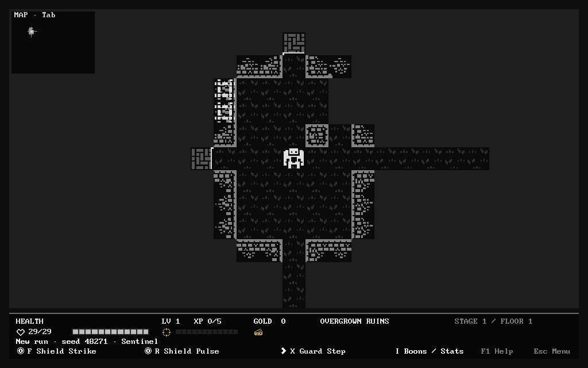
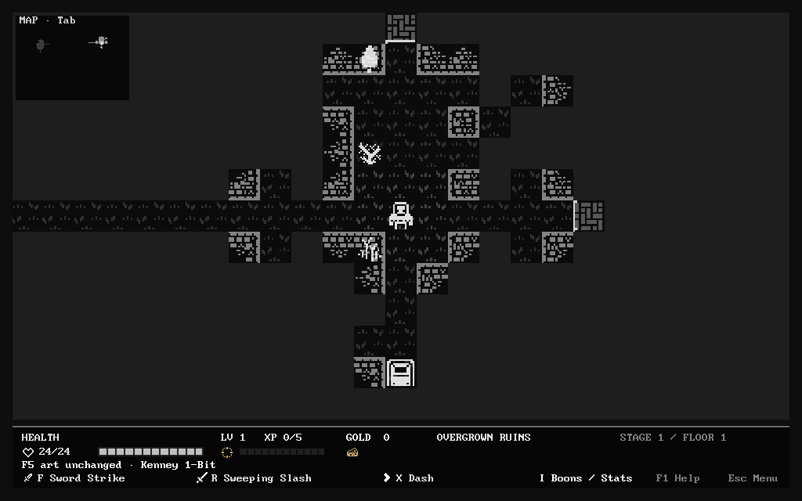
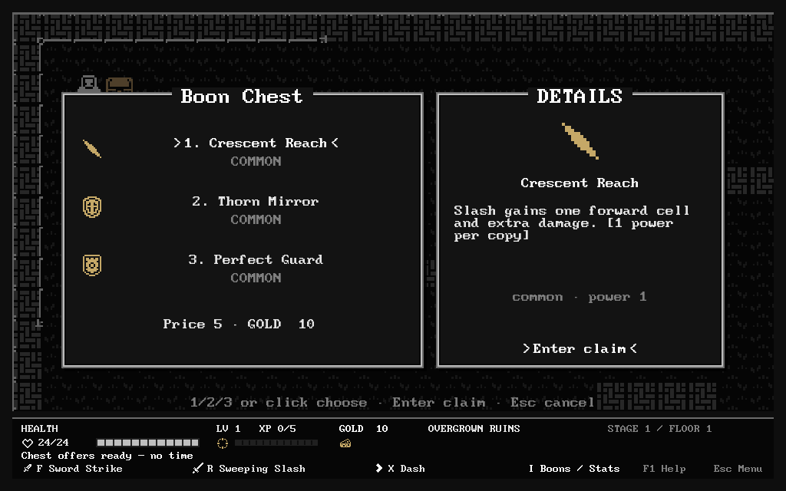
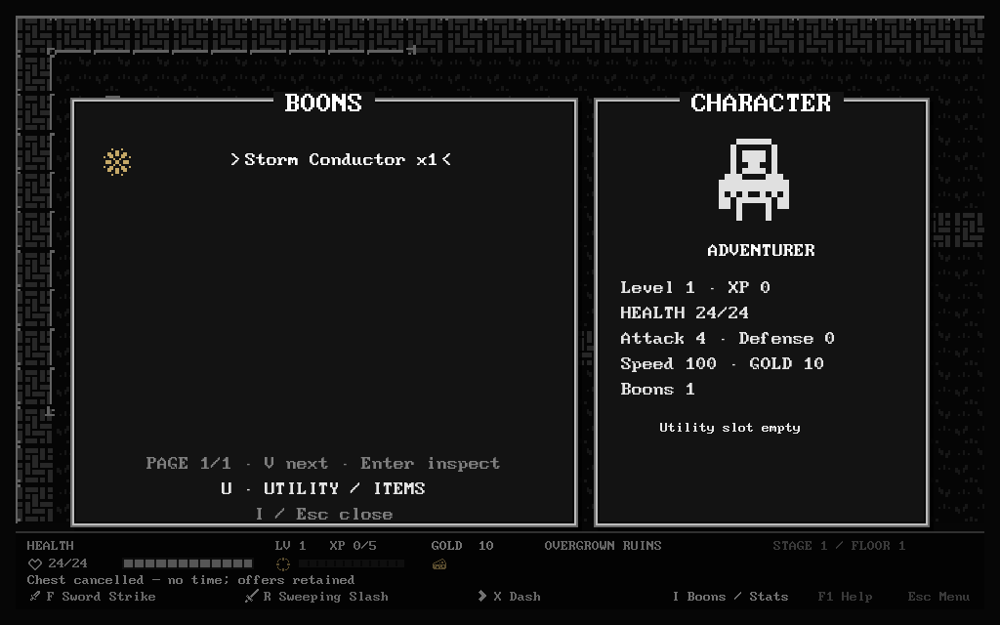
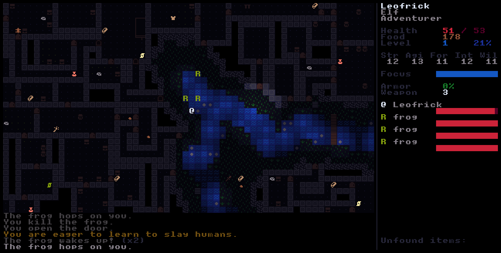

[](https://github.com/gongahkia/roag/releases/tag/1.0)

# `Roag` 🗡️

A turn-based Lua/LÖVE2D roguelike with fifteen classes, seven two-floor biomes,
103 boons and some secrets. Move one tile, aim an attack or wait: the world advances
when you commit an action. Reading menus and idle time do not advance the run.

The classic `1.0.0` gameplay is restored. Artwork now comes from the newer preserved
catalogue through [599 explicit role mappings](assets/classic-bindings.json).
The audit and source history are recorded in [RESTORATION.md](docs/classic-restoration/RESTORATION.md).
The colony/web direction is archived; this version is a desktop LÖVE game.

## Stack

* *Script*: [Lua](https://www.lua.org/), [LÖVE2d](https://love2d.org/)
* *Font*: [BigBlue Terminal](https://int10h.org/blog/2015/12/bigblue-terminal-oldschool-fixed-width-font/)
* *Sprites*: [Urizen](https://vurmux.itch.io/urizen-onebit-tileset) by vurmux, with catalogued Godot icons and input prompts
* *Source catalogue*: `assets/catalog.json.gz` (preserved unchanged); see [art mapping notes](docs/classic-restoration/ART_MAPPING.md)

## Historical screenshots

These show the original Kenney appearance; the restored game uses the newer artwork.

<div align="center">
  
  
</div>

<div align="center">
  
  
</div>

## Usage

Install **LÖVE 11.5**, **LuaJIT** (for tests), and **Python 3.10+** (for asset checks).
There is no Node, browser or .NET requirement. Run the game locally:

1. First clone the repository.

```console
$ git clone https://github.com/gongahkia/roag && cd roag
```

2. Then run the below from repo root.

```console
$ make game
```

The direct launcher is `./roag.sh`. Set `LOVE_BIN` if LÖVE is installed at a custom
path. `make test` runs the gameplay regressions, `make gui` runs actual LÖVE
input/save checks under an available display, and `make package` creates
`dist/roag.love` containing the game and current artwork.

To change a sprite, edit its role in `assets/classic-bindings.json`, using an existing
ID from `assets/catalog.json.gz`; run `make assets` and restart the game. Source PNGs
and the catalogue remain unchanged. `make assets-check catalog-test preservation`
checks the mapping, original pixels and recoverability of the retired art. Adjacent
crops are not assumed to be animation frames; some roles intentionally share a crop.

## Controls

| Key | Action |
| --- | --- |
| `W` / `S` or arrows, then Enter | Select and confirm menu options |
| Title: `C` / `N` / `U` | Continue the saved run / quick-start the selected class / view achievements |
| Class chooser: arrows or `W` / `A` / `S` / `D` | Cycle all fifteen classes; `1`–`9` select the first nine, Enter starts the selected class |
| `W` / `A` / `S` / `D` or arrows | Move one cardinal tile; bump a hostile to attack or a chest/exit to inspect |
| `F` / `R` / `X` | Aim the class's basic attack / special / movement skill; Wayfinder's `X` returns immediately when a beacon exists |
| Direction, then Enter | Choose aim and commit; `Q` / `E` / `Z` / `C` also aim diagonally |
| `P` or controller LB while aiming | Toggle Pilgrim's Vow when owned; its HP price is paid only on a committed attack |
| Space / `.` / keypad `5` | Wait one action |
| `I` / `V` | Open boons and character stats / open or advance the boon page |
| Boon panel: up/down, left/right or wheel, Enter | Select a boon, change pages, inspect it; `I` or Escape closes the panel |
| `E` while exploring | Inspect nearby room objects and services |
| `U` | Inspect or use the carried utility; when aiming an Escape Scroll, `1`–`3` choose distance |
| Chest/route: `1`–`3` or arrows, then Enter | Select and confirm an offer/route; Escape cancels without spending |
| Room service: arrows, then Enter | Select, inspect and confirm; Escape goes back |
| `Tab` | Show or hide the minimap |
| `F1` / `F3` / `F5` | Contextual help / diagnostics / refresh artwork and audio without changing the run |
| Escape | Cancel aiming, close a panel or open Pause |
| Pause: `S` or `2` / `3` | Save & Quit / open Settings |
| Settings: left/right, `Tab` or `]`, `[` | Adjust the selected option, next category, previous category |
| Left click / drag | Select menu options and nearby objects / adjust volume sliders; double-click a boon to inspect it |
| Controller D-pad, A / B, Start / Back | Move or aim; confirm / cancel; pause / minimap |
| Controller X / Y / RB | Aim basic attack / special / movement skill |
| Controller LB / left-stick click / right-stick click | Open/advance boons (toggle Vow when aiming) / nearby services / utility |

## Reference

Name-wise, `Roag` pays homage to [Rogue (1980)](https://en.wikipedia.org/wiki/Rogue_(video_game)). Duh.

Credits to [Bob Nystrom](https://github.com/munificent)'s [Hauberk](https://github.com/munificent/hauberk) also.


